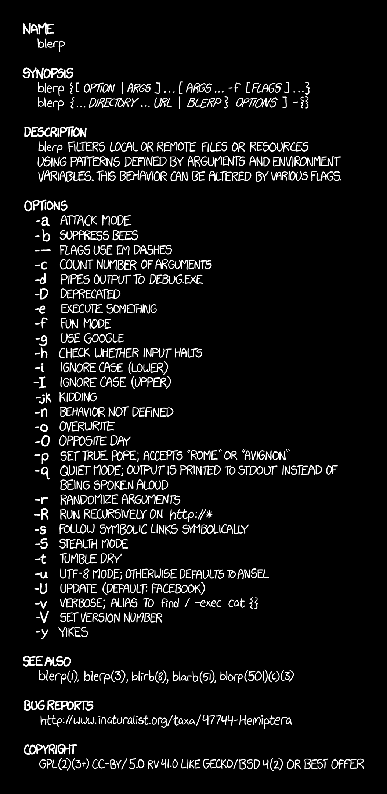

# dotfiles

My UN*X dotfiles and other configuration files.

These will work on most *NIX environments; they' started back on 1980s UNIX distributions and have followed me to macOS. Some of these files are in use on the <a href="https://msdn.microsoft.com/en-us/commandline/wsl/about">Windows Subsystem for Linux</a>, so there's that.

Feel free to peruse these, and even to use them as a start for your own use. I have stood on the <a href="https://stackoverflow.com/">shoulders of giants</a>, although all mistakes are my own (and,, besides, <a href="https://en.wikipedia.org/wiki/Turtles_all_the_way_down">it's turtles all the way down</a>, so now it's your turn to bulid for those who follow).

Each the files in this repo has been added because I want to:

1. have easy access for deployment on new UN*X machines I wind up working on, including my go-to platform, macOS [Darwin].
2. share with others those things over the years I've found useful, productive, and fun.

I've commented as heavily as possible, used some interesting bash techniques to get things done, and generally tried to stay out of the way of my future self whilst making it possible to go back and tweak and add features without cursing my past stelf too much :-) 

Comments and corrections are always welcome.

 </a>

| filename        | purpose |
| ------------- |------------- |
| .bash_profile   | Primary workhorse for customizing your bash experience. My `.bashrc_profile` includes a test yoke, which you can switch on to validate the internal functions I've written. I'm a quality assurance software engineer, and I'm really proud of giving this file the full software reliability treatment. |
| .gitconfig | `git` configuration |
| .gitignore | Local additions for things `git` should ignore, extending `.gitignore_global`. |
| .gitignore_global	| A master `.gitignore` based upon the collected wisdom we call <https://www.gitignore.io>. |
| .grc/ | Radovan Garabík's [Generic Colouriser ](http://kassiopeia.juls.savba.sk/~garabik/software/grc.html) is an almost-trivial way to colorise text output from any program. Makes everything easier. |
| .inputrc     | Changes input processing for all programs that use readline (like bash, python, etc) and turbo-charges what you can do with fingers still on the keyboard |
| .macos | Mathias Bynens' jaw-dropping _magnum opus_ of `default write` commands that tweak every aspect of macOS (found in his own [dotfiles](https://github.com/mathiasbynens/dotfiles/blob/master/.macos) repo). |
| .set_colors.sh | Provide color shortcuts for shell prompts, etc. |
| .set_prompt.sh | Create an easy-to-love command shell prompt. |
| .vimrc | Configure the `vim` text editor to be borderline awesome. |
| bin | My home-grown binaries (programs)
| README.md	| This very file. |

For a hard-core look at dotfile management, visit <http://dotfiles.github.io>.

A shout-out to  [dillinger.io](http://dillinger.io/), the most amazing, free, online GFM editor (which was used to edit and preview the very text you're reading.